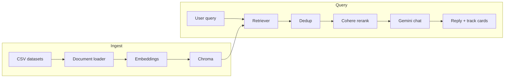

# Songbird

**Semantic song recommendations** powered by Spotify-style track metadata, vector search, reranking, and a conversational model. The web UI ships with a retro **Y2K purple** aesthetic.


---

## Overview

Songbird turns natural-language taste (“late-night synth, high energy, nostalgic”) into a shortlist of tracks from an extensive dataset. The pipeline:

1. **Embed** track documents (title, artist, audio features, playlist context) with Google Gemini embeddings.
2. **Retrieve** similar vectors from **Chroma** with a similarity threshold.
3. **Deduplicate** by track name (with a fallback key).
4. **Rerank** candidates with **Cohere** for tighter relevance to the query.
5. **Generate** a friendly explanation with **Google Gemini** (structured `AIMessage` content is normalized to plain text for the API and CLI).



---

## Features

- **RAG-style retrieval** over embedded track rows (no invented songs outside the retrieved set; the LLM is instructed to stay grounded).
- **Web app**: FastAPI + static frontend — `POST /api/recommend` returns `{ "reply", "tracks" }` with Spotify links when URIs are present.
- **CLI**: run `retrieval.py` directly for terminal recommendations.
- **Chroma persistence** under `vector_store/` with telemetry disabled via a small no-op client hook.

---

## Requirements

- **Python** 3.10+ recommended  
- API keys: **Google AI Studio** (Gemini embeddings + chat) and **Cohere** (rerank)

---

## Installation

```bash
git clone https://github.com/mercurialw0rld/Songbird.git
cd Songbird
python -m venv .venv

# Windows
.venv\Scripts\activate

# macOS / Linux
source .venv/bin/activate

python -m pip install -r requirements.txt
```

---

## Environment

Create a `.env` file in the project root:

```env
GOOGLE_API_KEY=your_google_generative_ai_key
COHERE_API_KEY=your_cohere_key
```

LangChain’s Google and Cohere integrations read these standard variable names. Never commit real keys to the repository.

---

## Dataset

Place CSV files under `Dataset/` (see `csv_process.py` for the expected columns: track name, artist, album, playlist, genre, audio features, Spotify URIs, etc.). The bundled loaders target `**/*.csv` in that folder.

---

## Build the vector index

From the project root, after `.env` is configured:

```bash
python vectordatabase.py
```

This loads documents via `csv_process.py`, embeds them in batches, and persists Chroma data under `vector_store/`.

> **Note:** `retrieval.py` and `vectordatabase.py` must use the **same Chroma `collection_name`** so queries hit the index you built. If you change one, align the other.

---

## Run the web app

```bash
python -m uvicorn app:app --reload --host 127.0.0.1 --port 8765
```

On **Windows**, if `uvicorn` is not on your `PATH`, `python -m uvicorn` (as above) is the reliable approach. You can also double-click **`run.bat`** in the repo root.

Open **http://127.0.0.1:8765** — the UI posts to `/api/recommend` and renders the model reply plus track cards.

### API

| Method | Path | Body | Response |
|--------|------|------|------------|
| `POST` | `/api/recommend` | `{ "query": "string (1–2000 chars)" }` | `{ "reply": "…", "tracks": [ … ] }` |

Interactive docs: **http://127.0.0.1:8765/docs**

---

## Run the CLI

```bash
python retrieval.py
```

You will be prompted for a free-text query; the script prints the recommendation string.

---

## Project layout

```
Songbird/
├── app.py                 # FastAPI app + static mount
├── run.bat                # Windows launcher (python -m uvicorn)
├── retrieval.py           # Retriever, rerank, Gemini, payload for UI
├── vectordatabase.py      # Chroma creation / resume embedding
├── csv_process.py         # CSV → LangChain Documents
├── chroma_telemetry_noop.py
├── Dataset/               # Source CSVs
├── static/                # Frontend (HTML / CSS / JS)
├── vector_store/          # Persistent Chroma (gitignored recommended)
├── requirements.txt
└── README.md
```

---

## Tech stack

| Layer | Choice |
|--------|--------|
| Embeddings & chat | Google Gemini (`langchain-google-genai`) |
| Vector store | Chroma (`langchain-chroma`) |
| Reranking | Cohere (`langchain-cohere`) |
| Web | FastAPI, Uvicorn |
| Data | Pandas, custom `CSVLoader` |

---

## License

Add a `LICENSE` file and update this section when you publish the repository (for example MIT or Apache-2.0).

---

<p align="center">
  <sub>Songbird — RAG for playlists, wrapped in chrome and ultraviolet.</sub>
</p>
